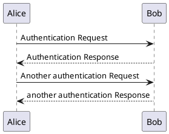

# Pandoc PlantUML Filter

[](https://travis-ci.org/kbonne/pandoc-plantuml-filter)


Replaces `CodeBlocks` with `plantuml` class with PlantUML generated UML diagram

**This is a work in progress.**

## Requirements

- `plantuml` in `PATH` which launches PlantUML jar (see `scripts` folder)
- `pandoc`

## Usage

e.g. Generating .pdf from this file
```
pandoc README.md --variable=geometry:a4paper,margin=2cm --variable=fontsize:11pt -o README.pdf --filter ./dist/build/pandoc-plantuml-filter/pandoc-plantuml-filter
```

## Tests

### Javascript

Should be skipped

```javascript
var s = "JavaScript syntax highlighting";
alert(s);
```

### PlantUML

Should be processed!



This one as well

```{.plantuml include="README.md"}
@startuml
class Car

Driver - Car : drives >
Car *- Wheel : have 4 >
Car -- Person : < owns

@enduml
```
