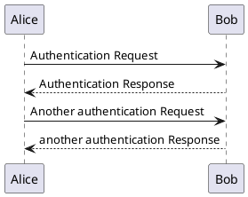

# Pandoc PlantUML Filter

[](https://travis-ci.org/kbonne/pandoc-plantuml-filter)

Filter for [pandoc] that replaces `CodeBlocks` with a `plantuml` class with [PlantUML] generated UML diagrams.

This allows you to use code blocks in your documents containing [PlantUML] DSL
which will be replaced by actual UML diagrams after coversion using [pandoc] and
this filter.

**This is a work in progress.**

## Example

[This](README.pdf) is an example `.pdf` generated of this document using the
command found below in _Usage_.

## Requirements

- `plantuml` in `PATH` which launches [PlantUML] jar (see `scripts` folder)
- `pandoc`

## Install

### From package repository (Ubuntu PPA)

```
add-apt-repository ppa:kbonne/pandoc-plantuml-filter
apt-get update
apt-get install pandoc-plantuml-filter
```

### From Source (with Stack)

```
git clone https://github.com/jodonoghue/pandoc-plantuml-filter.git
cd pandoc-plantuml-filter/
stack install
```

### From Source (with Cabal)

```
git clone https://github.com/jodonoghue/pandoc-plantuml-filter.git
cd pandoc-plantuml-filter/
cabal install
```

## Usage

e.g. Generating .pdf from this file
```
pandoc README.md --variable=geometry:a4paper,margin=2cm \
--variable=fontsize:11pt -o README.pdf --filter pandoc-plantuml-filter
```

## Limitations

- No tests
- Calls hard-coded `plantuml` which should be in `PATH` (on Windows,
  `plantuml.jar` needs to be in `C:\Bin`.
- Temporary files are generated in `CWD` and not removed.
- **No tests**

## Tests

### Javascript

Should left as-is

```javascript
var s = "JavaScript syntax highlighting";
alert(s);
```

### PlantUML

Should be processed!



This one as well

```{.plantuml include="README.md"}
@startuml
class Car

Driver - Car : drives >
Car *- Wheel : have 4 >
Car -- Person : < owns

@enduml
```

[PlantUML]: http://plantuml.sourceforge.net/
[pandoc]: http://johnmacfarlane.net/pandoc/
